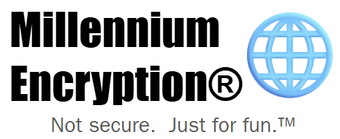

# MillenniumEncryption

MillenniumEncryption&reg; is an encryption method inspired by the way text messages used to be sent on 
numerical keypads.  It isn't secure beyond its being unusual - a security vanquished by its publication
here - nor it is compressive, nor particularly useful unless there is some peculiar application where
the power consumption of transmitting high bits needs be reduced - but it is fun to enjoy the 
ᴀ ᴇ ꜱ ᴛ ʜ ᴇ ᴛ ɪ ᴄ.

It is not a registered trademark; that's also part of the A E S T H E T I C.

## What's in this package?

MillenniumEncryption&reg; software consists of three applications and two libraries.

### Software
* **MillenniumJackdaw** is the simple, local command-line interface that allows
one to encrypt and decrypt files or strings.  Its code is found in `src/loc`.
* **MillenniumSerpent** is the graphical user interface for managing codebooks
and for the client of one sending messages to a central server.  Its code is found in `src/app`.
* **MillenniumFalcon** is the server itself, and the first program to be named,
originating the animal theme.  Its code is found in `src/server`.

### Libraries
* `millennium_crypt` contains functions and classes for implementing the special code, managing codebooks, etc.
Its code is found in `src/crypt`.
* `millennium_server` contains utilities for the shared communications between the server and client.
Its code is also found in `src/server`.

## Dependencies

The suite of software uses the following dependencies for the following purposes:

* [Qt framework](https://www.qt.io/product/framework) is the framework used by the client.  The client uses QtWidgets for its graphical user interface,
QtNetwork for its communication with the server, and QtSQL for locally storing message archives.
* [SQLite](https://sqlite.org/index.html) is used by the server for storing its database of users and friend requests.  It does not
store message archives; that is the responsibility of users.
* [Winsock] is currently used by the server for its communication with the client - this is Windows's socket
library; it needs no special installation on Windows and does not function off Windows.